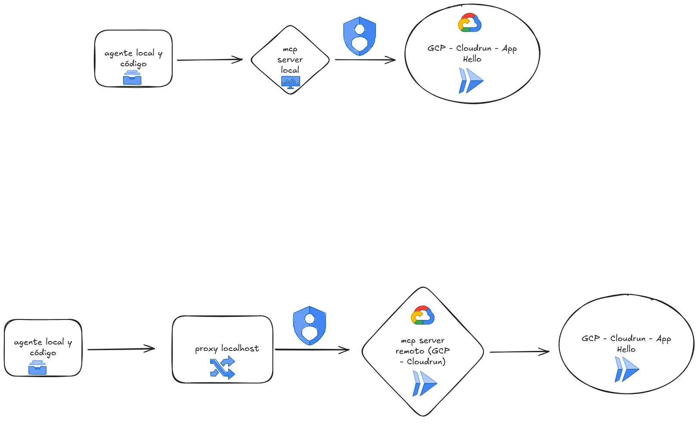

# Cloud-Run-MCP

## Desplegar el MCP server Local

### Requisitos previos

- [Node.js](https://nodejs.org/en/download)
- [Google Cloud SDK](https://cloud.google.com/sdk/docs/install)

### Crear archivos locales e instalar dependencias

```bash
npm install
```

Estructura de archivos:

```
hello-cloudrun/
├── index.js
├── package.json
└── node_modules/
```

### Configuración de cuenta y proyecto de Google Cloud

Autenticación en Google Cloud:

```bash
gcloud auth login
```

Credenciales de aplicación predeterminadas:

```bash
gcloud auth application-default login
```

Configurar proyecto por defecto:

```bash
gcloud config set project <ID_PROYECTO>
```



### Ejecutar con NPX

```bash
npx -y https://github.com/GoogleCloudPlatform/cloud-run-mcp
```

### Clonar e instalar desde GitHub

```bash
git clone https://github.com/GoogleCloudPlatform/cloud-run-mcp.git
cd cloud-run-mcp
npm install
```

(Si es necesario instalar dependencias adicionales)

```bash
npm install
```

---

## Desplegar el MCP server a Cloud Run

```bash
gcloud run deploy cloud-run-mcp \
  --image us-docker.pkg.dev/cloudrun/container/mcp \
  --no-allow-unauthenticated \
  --platform managed \
  --region us-central1
```

## Conectarse al servidor usando IAM Proxy

```bash
gcloud run services proxy cloud-run-mcp \
  --port=3000 \
  --region=us-central1 \
  --project=TU_ID_PROYECTO
```

## Cambiar la configuración en VS Code o en `mcp.json`

```json
"cloud-run": {
  "url": "http://localhost:3000/sse"
}
